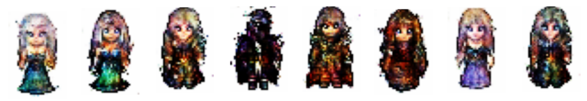

# Wyniki z DCGANa

Model był trenowany przez 1500 epok.

### Kilka lepszych wyników

### Obrazki z epok 1300, 1400 i 1500

# Wyniki z ProGANa

### Kilka lepszych wyników

### Przykładowe epoki

### Próba poprawy obrazków za pomocą autoencodera

### Próba uśredniania obrazków z kilku modeli (z różnych epok)

#### Wygenerowane obrazki

#### Uśrednione obrazki z 5 epok

#### Uśrednione obrazki z 10 epok

#### Uśrednione obrazki z 20 epok

#### Zbliżenie na przykładowe dwa uśredniane obrazki

### Wyniki ze StyleGANa

#### Przykładowe epoki

#### Interpolacje pomiędzy obrazami

#### Próba obrotu postaci

